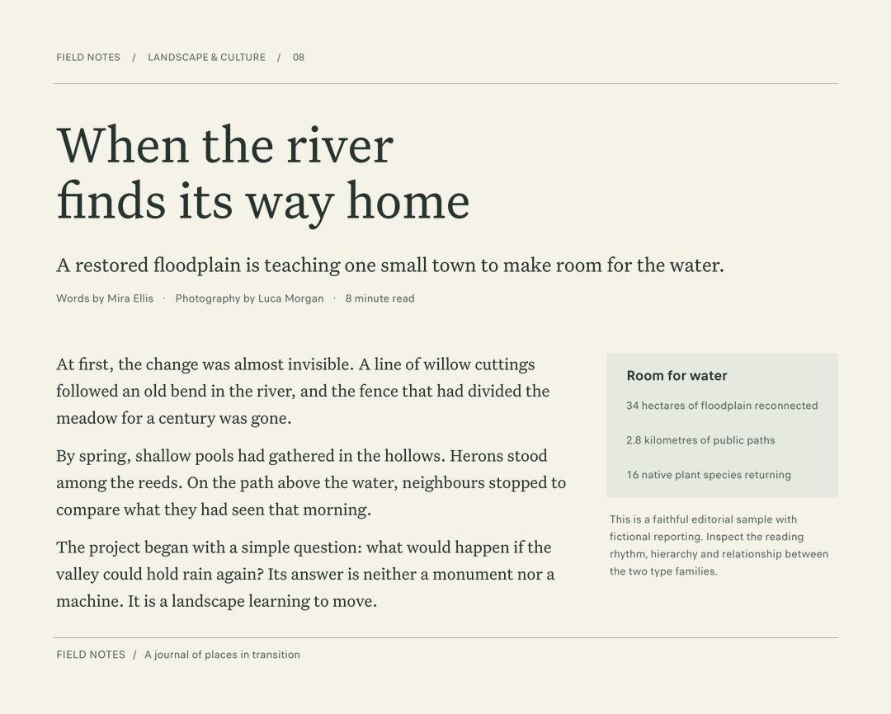
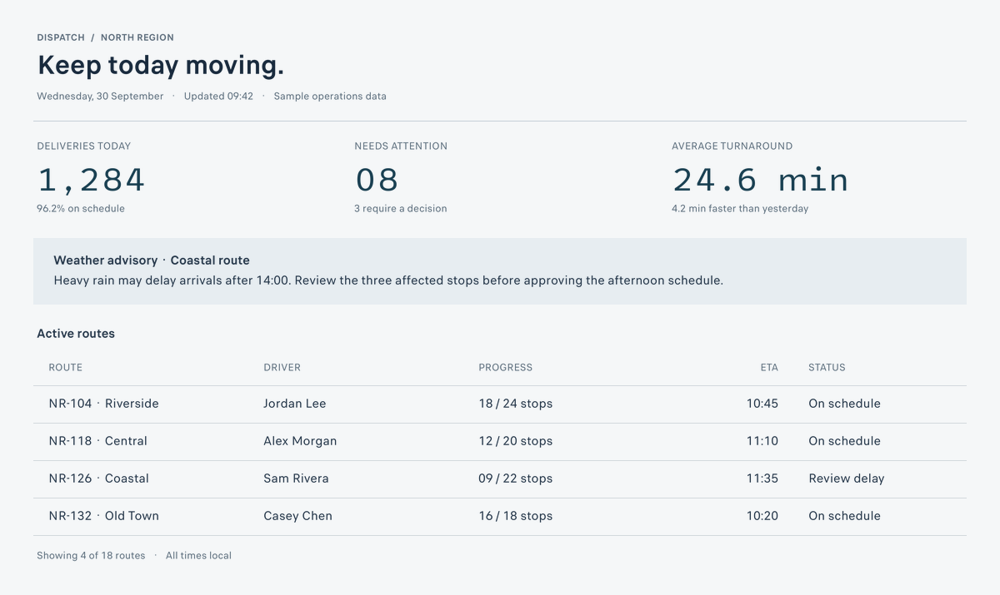
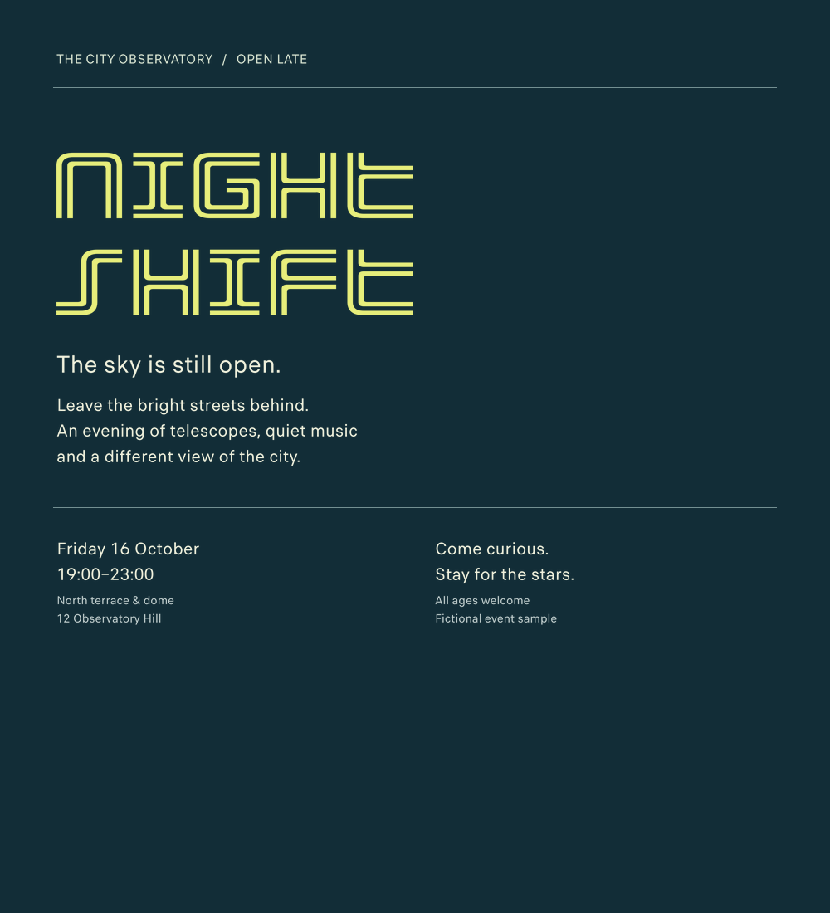

# Type Evidence — Font Discovery & Typography for AI Agents

Help AI agents find and use real fonts that fit the work—from quiet reading faces to expressive display type. **Type Evidence** searches local font collections, explores visual alternatives, compares typography in context, and resolves the exact styles and files to implement a choice.

Use it for interfaces, games, branding, editorial layouts and documents through a **JSON CLI or local MCP server**. Bring fonts you already have, or build the pinned mixed open/proprietary collection. Optional FontCLIP retrieval searches rendered letterforms, including fonts with incomplete category metadata. Fonts, model weights, indexes and project text stay local.

[Get started](docs/getting-started.md) · [MCP / agent integration](docs/agents.md) · [Visual examples](https://gavinjudd.github.io/type-evidence/#examples) · [Contribute](CONTRIBUTING.md) · [License and font rights](docs/licensing.md)

## See typography in context

These are actual harness outputs using exact local faces, with fictional sample content. They illustrate different applications, not automatic design recommendations or a grant to redistribute the pictured fonts.

| Reading and editorial | Interfaces and data | Expressive display |
| --- | --- | --- |
| [](evidence/v0.2/composition-examples/editorial/manifest.json) | [](evidence/v0.2/composition-examples/interface/manifest.json) | [](evidence/v0.2/composition-examples/poster/manifest.json) |

Each image links to its exact-face manifest. [Composition specs](examples/) and the [recorded browser checks](evidence/v0.2/composition-browser/README.md) show how previews become implementation recipes.

## What you can do

- **Discover beyond familiar names.** Search a brief, page through alternatives, or explore neighbors of an inspected font or typography crop. Visual retrieval is optional and reports its actual coverage.
- **Choose for the project.** Supply real text, language, audience, medium, size, density and required styles. Compare finalists in a specimen or a composition with roles, columns, panels and tables.
- **Revise and apply.** Inspect images, change the choice or layout, and resolve exact files, weights, variation axes and features. Keep the existing font or a single family when it works best.
- **Use the same operations from different agents.** CLI and MCP share discovery and rendering. MCP supplies bounded results and inline PNG previews; a nonvisual agent receives measurements without pretending to judge the image.

The harness provides candidates and evidence. You or your agent still make the design decision. It does not generate font files or install fonts into the operating system.

## Get started

**Python 3.10+** is required; use Git to clone the repository. Install from source—no package-registry install is assumed:

```sh
git clone https://github.com/gavinjudd/type-evidence.git
cd type-evidence
python3 -m venv .venv
.venv/bin/python -m pip install -e .
.venv/bin/type-evidence doctor
```

On Windows, use `py -3 -m venv .venv`, then `.\.venv\Scripts\python.exe -m pip install -e .` and `.\.venv\Scripts\type-evidence.exe doctor`.

Choose the setup that matches your task:

| Start with | What it needs | Next step |
| --- | --- | --- |
| Fonts you already have | An authorized local font directory; no collection or model download | [Index your fonts](docs/getting-started.md#use-fonts-you-already-have) |
| The pinned broad collection | Roughly 6 GB for the source collections, plus catalogs and caches; review source/font rights | [Fetch and index](docs/getting-started.md#use-the-pinned-collection) |
| A code contribution | Core and test dependencies only; synthetic test fonts are generated locally | [Develop without the corpus](CONTRIBUTING.md#develop-without-downloading-fonts-or-a-model) |

### Enable visual discovery

After creating a catalog, optional `.[visual]` dependencies, the approximately **653 MB pinned checkpoint**, and a local rendered-font index enable FontCLIP text/image retrieval. Search itself never downloads weights. Start with a bounded index, then resume; see [visual setup, storage and script coverage](docs/getting-started.md#add-optional-visual-discovery). Ordinary metadata/measurement discovery works without the model.

## Find, inspect, revise, apply

After activating your virtual environment and creating a catalog:

```sh
type-evidence search --query 'warm humanist, not playful or handwritten' --role ui --text 'Review 24 requests' --weight 400 --upright --size 15 --limit 6
type-evidence search --query 'warm humanist, not playful or handwritten' --role ui --text 'Review 24 requests' --weight 400 --upright --size 15 --limit 6 --offset 6
```

Take an exact `id` from a result, inspect its family and render the actual text. `EXACT_ID`, `BASELINE_ID` and `CANDIDATE_ID` below are placeholders to replace:

```sh
type-evidence family EXACT_ID
type-evidence compare BASELINE_ID CANDIDATE_ID --text 'Review 24 requests' --sizes 15 24 48 --out library/first-comparison
type-evidence compose --spec examples/composition-interface.json --out library/interface-study
type-evidence resolve EXACT_ID
```

The supplied composition examples use exact IDs from the pinned collection. For your own fonts, replace their role IDs and settings first. See the [composition schema](docs/contract.md), [reference-led recovery loop](docs/agents.md#recover-from-a-weak-first-result), and [source maintenance guide](docs/maintenance.md).

Compositions produce an immediate PNG preview and an HTML/CSS/JS implementation recipe. Stage authorized exact font assets to use the live recipe; its loading gate checks hashes and font loading before displaying it. A screenshot is not proof of browser, printer or game-engine equivalence.

## Use from an agent

Read [AGENTS.md](AGENTS.md) for the bounded decision loop, or configure the [stdio MCP server](docs/agents.md#local-setup-and-mcp). MCP supports search, paging, family inspection, exact assets, comparisons, contextual compositions and reopening preview images. No particular agent model or editor is required.

All successful CLI output is JSON. Put `--catalog /absolute/path/catalog.sqlite` **before** the subcommand. `doctor`, `stats`, `issues` and `visual-status` describe the current local setup. Agent setup instructions help after an agent reaches this repository; they do not guarantee discovery in search results.

## Collection and evidence

The recorded v0.2 catalog contains **27,520 faces, 8,041 distinct family names and 8,710 family groups**, including 378 variable faces. Family groups preserve vendor/version/width differences; faces are not unique families. The collection retains both original mixed sources and adds selected Google Fonts and Arrow Type sources. [Collection scope and pins](docs/collection-v2.md).

The default visual index covers **26,313 faces (95.61%)** in the recorded catalog, using configured sample text at default axes. Unsupported render formats, incomplete samples and explicit rendering failures remain visible. Language support and final styles need their own checks. [Visual coverage](evidence/v0.2/visual-coverage.json).

In the [three-case held-out evaluation](evidence/v0.2/heldout/README.md), the harness did **not** improve final compositions over basic access to the same fonts. Semantic retrieval sometimes missed the intended tone; supplied references recovered more useful directions in a separate development study. Tests establish behavior, not better taste. [Full evidence index](evidence/v0.2/README.md).

## Development

Contributions can improve retrieval, source metadata, platform behavior or design evaluation. [CONTRIBUTING.md](CONTRIBUTING.md) maps the extension points, gives starter tasks and explains how to test without the large downloads. Use the [issue forms](https://github.com/gavinjudd/type-evidence/issues/new/choose) for reproducible bugs, poor recommendations or proposals.

The recorded v0.2 suite passed **277 tests** with optional visual dependencies; the clean core suite passed **267 with 10 optional skips** on native Linux, macOS and Windows. Full collection, optional visual-model and browser workflows remain unverified on Windows; CUDA is unverified. [Test and platform scope](evidence/v0.2/portability.json).

## License

The original harness code and documentation are available under the [MIT License](LICENSE). **This does not license the fonts or model weights.** Dependencies and third-party assets retain their own terms; mixed-source availability is not permission to use or redistribute every face. No font binaries or model weights are included here. Read the [licensing and attribution guide](docs/licensing.md) before distributing assets.
