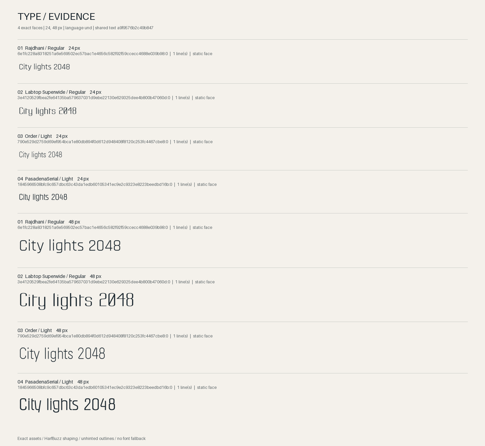
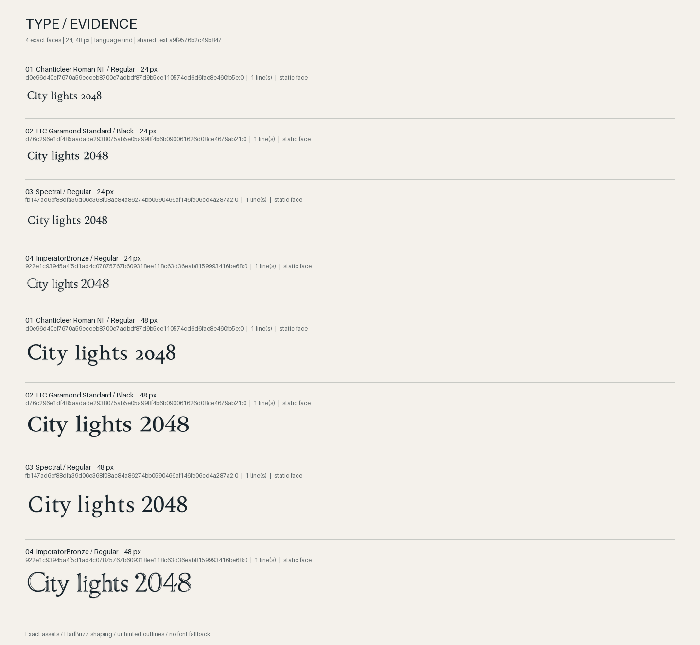

# Retrieval recovery study

The initial learned searches missed their intended appearance. An explicitly selected visual reference recovered useful alternatives; prompt rewrites, extra negatives and eight-view augmentation did not establish a reliable semantic fix.

This is a historical, non-held-out exploratory study. The catalog and indexes were read only. It predates later style-name conflict guards, so a replay using newer code may return different candidates. It does not establish a general design-quality improvement.

| Probe | Observed result |
| --- | --- |
| Initial elegant / high-contrast serif | Chunky, distressed and novelty faces led the results. |
| Initial angular / futuristic / technical | Fragmented and outline faces led the results. |
| Comma prompt, attribute ensemble, photo wording | No material recovery of either direction on the frozen full index. |
| Official rendering and eight augmented views | No material recovery in the 18-face comparison set; no basis for an eightfold full reindex. |
| More negative words or avoiding the bad top face | Sometimes drifted further, including a pictogram face. |
| Selected Rajdhani image reference | Readable, narrow technical alternatives. |
| Selected Bodoni image reference | Three readable serif alternatives and one questionable outlined face. |

The references are **supervised direction anchors**, not zero-shot recovery. They supply a preferred appearance after the semantic miss. Judge the actual glyphs: some embedded weight/style labels are wrong.





## Evidence and method

- `initial-smoke.json` preserves the complete original smoke response, including failed initial candidates and the original reference self-match observation. Its images remain in the sibling `query-smoke/` directory.
- `prompt-probes.json` records all three queries, four prompt variants per query, top candidates and fresh-versus-stored vector checks. The stored masks match fresh renders; vector cosine is approximately 1.0 on all three checked faces.
- `image-probes.json` records all 18 selected IDs, cosine scores and rankings for stored full specimens, official centered rendering, official rendering with eight augmented views, and current rendering with eight augmented views. The set combines the 12 initial-result faces with six eligible contrast-family representatives. This is a selected-set comparison, not a corpus rerank.
- `api-recovery.json` records the exact requests and top four candidates for two queries × negative / avoid / selected-reference routes. Both unsuccessful routes are retained.
- `summary.json` records direct visual observations and limitations. `provenance.json` gives source and published SHA-256 values. PNG, initial-smoke, prompt and API copies are byte-identical; the image-probe scope sentence is corrected to the actual 18 faces, with all numeric records unchanged. No fonts, checkpoint, catalog, cache or machine-specific paths are included.

The upstream comparison uses [FontCLIP commit 3d4c6af](https://github.com/yukistavailable/FontCLIP/tree/3d4c6af01f668800d8e4f9f4f753d29c74dad252). Its compound training prompts join attributes with commas and append `font`. Its retrieval example averages eight raw image embeddings from random rotations and square crops with area scale 0.3–1.0 before cosine comparison. Our bounded experiment uses seed 12345. Model-loader parity was established separately; it does not establish useful retrieval outcomes.

## Replay the existing-API recovery cases

Install the project's visual extra and prepare its pinned sources, catalog, model and visual index as described in the main README. From the repository root:

```sh
python evidence/v0.2/retrieval-recovery/reproduce.py --catalog library/catalog.sqlite --index library/visual.sqlite --checkpoint library/models/fontclip-original.pt --out library/recovery-replay
```

The script reads the six recorded requests, renders each reference from its recorded exact ID, and runs the current visual adapter and deterministic ranker. It saves a fresh compact report and the two reference comparisons without overwriting the historical evidence. Its path arguments are portable; it downloads nothing and leaves source/catalog/index unchanged. The output directory must be new. The checkpoint is hash-checked by the adapter before loading.

This small script replays the **existing-API recovery cases only**. The separate prompt and augmentation experiments are recorded as raw methods/results above; their rankings are not asserted by the replay script. Compare changed results against the recorded source/collection context rather than overwriting the initial failure.
